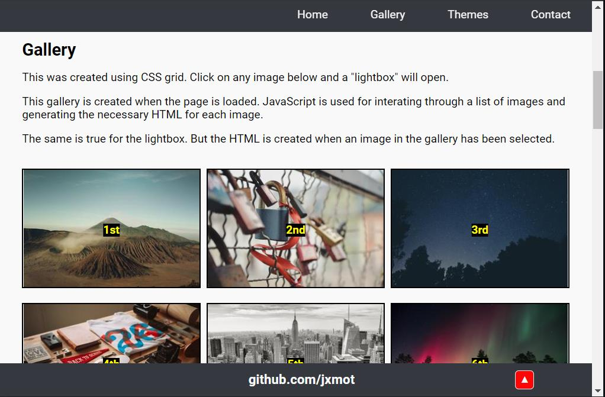
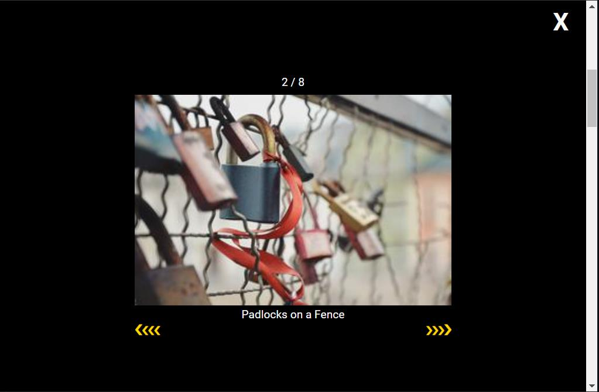
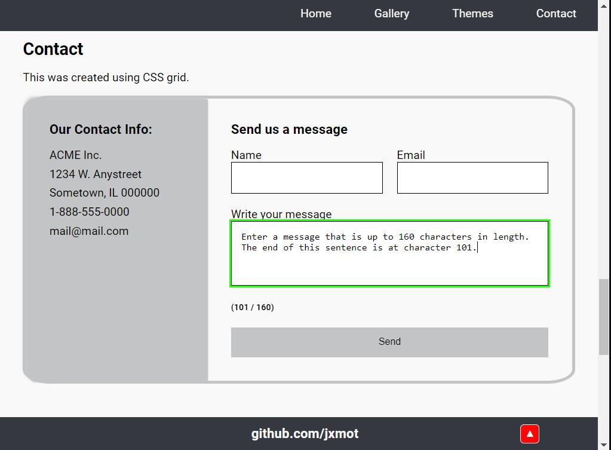
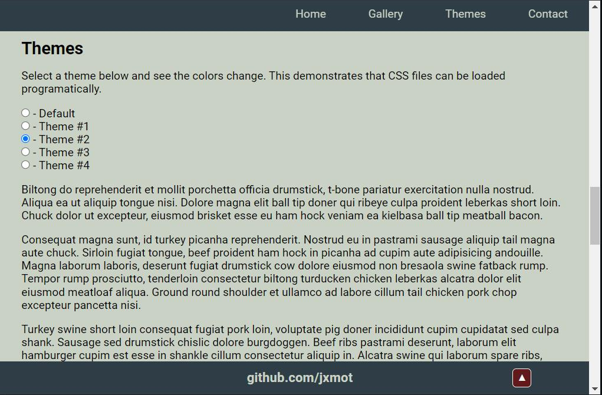
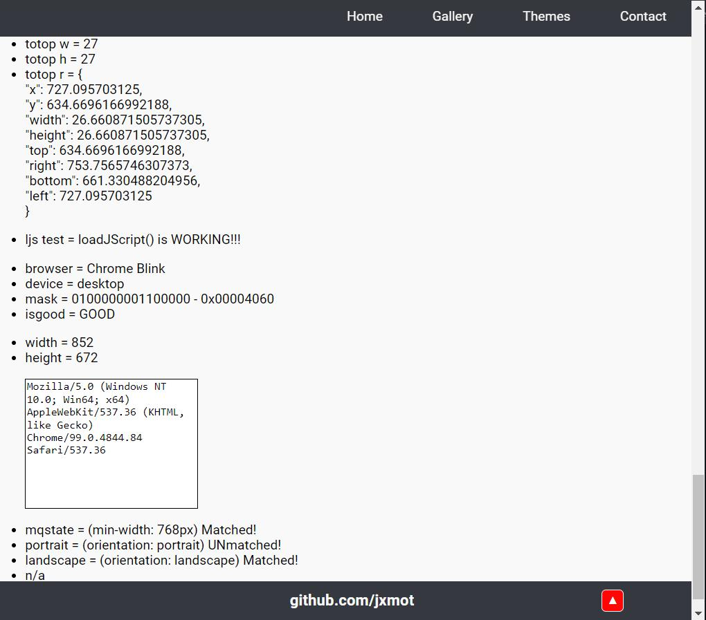

<h1 align="center">Website Template - NO BOOTSTRAP<h1>

Chapter 2

# Features

## Gallery

    <figure>
        
         
        <figcaption><strong>Simple Image Gallery</strong></figcaption>
    </figure>

## Lightbox

    <figure>
        
         
        <figcaption><strong>Simple Image Lightbox</strong></figcaption>
    </figure>

## Contact Form

    <figure>
        
         
        <figcaption><strong>Basic Contact Form</strong></figcaption>
    </figure>

## Theme Switch

    <figure>
        
        
         
        <figcaption><strong>Color Theme Examples</strong></figcaption>
    </figure>

## Develop and Debug

    <figure>
        
         
        <figcaption><strong>Optional Debug Data Ouput</strong></figcaption>
    </figure>

### Purpose

### Details

# Continue

To [chapter 3 - Desktop vs Mobile](CH3.md)...
