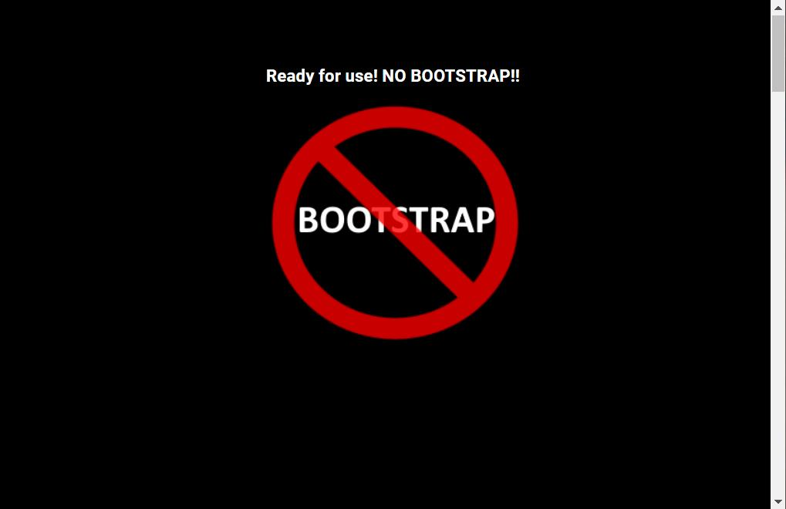
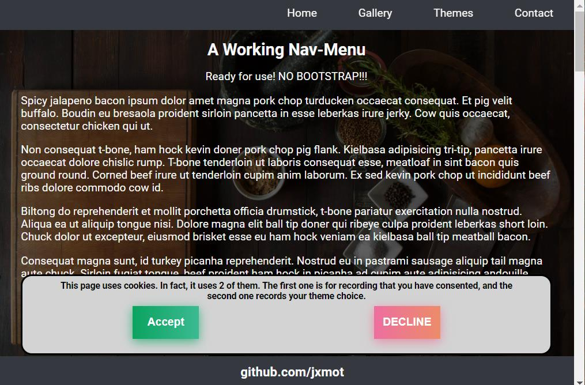
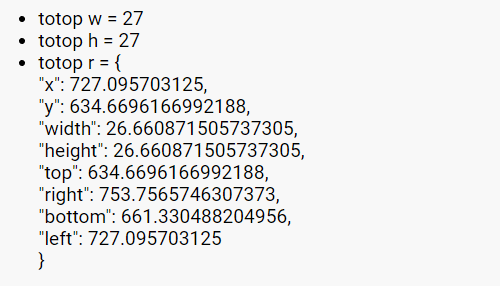
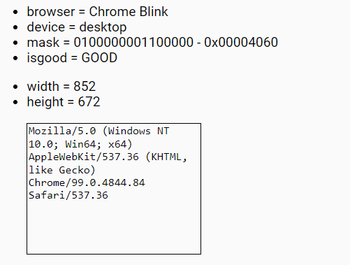
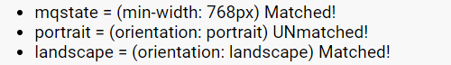

<h1 align="center">Website Template - NO BOOTSTRAP<h1>
<p align="center">Chapter 2<p>

# Features

## Welcome Splash

When the page is loaded a *splash* is display for about 5 seconds. It contains a heading and an image.

<div align="center">
    <figure>
        
        <br>
        <figcaption><strong>Desktop Screenshot with Cookie Consent</strong></figcaption>
    </figure>
</div>

## Cookie Consent

The cookie consent and the use of cookies is independent of the rest of the HTML/CSS/JavaScript. If you want to quickly disable the consent and use of cookies then edit `index.html` and comment out the line - 

```
    <script src="./assets/js/cookies.js"></script>
```

Change it to:

```
    <!-- <script src="./assets/js/cookies.js"></script> -->
```

<div align="center">
    <figure>
        
        <br>
        <figcaption><strong>Desktop Screenshot with Cookie Consent</strong></figcaption>
    </figure>
</div>

## Gallery

This is a *dynamically* created gallery. It designed to create the necessary HTML/CSS when the page is loaded. The image URLs are stored in a list. It's only necessary to edit the list and the gallery will change on the next page load.

CSS Grid was used to arrange the images.

<div align="center">
    <figure>
        
        <br>
        <figcaption><strong>Simple Image Gallery</strong></figcaption>
    </figure>
</div>

## Lightbox

This lightbox is also dynamically created. However, the HTML/CSS is not created until an image is selected from the gallery.

While the lightbox is active page scrolling is disabled.

<div align="center">
    <figure>
        
        <br>
        <figcaption><strong>Simple Image Lightbox</strong></figcaption>
    </figure>
</div>

## Contact Form

This is just a basic contact form without validation or email capability, and the form *fields* were laid out using CSS Grid. There is also a character counter for the message box. 

<div align="center">
    <figure>
        
        <br>
        <figcaption><strong>Basic Contact Form</strong></figcaption>
    </figure>
</div>

## Theme Switch

This demonstrates *dynamic loading* of CSS files. There is a collection of CSS files that set the colors.

<div align="center">
    <figure>
<!-- NOTE: When Github renders the images it will REMOVE the "margin", and ADD "max-width:100%" -->
        
        
        <br>
        <figcaption><strong>Color Theme Examples</strong></figcaption>
    </figure>
</div>

**NOTE:** If the cookie consent was *accepted* the theme choice will be saved to a cookie. If the consent is *declined* then no cookie will be saved. When the page loads if the consent cookie is present then the theme cookie is read and it's contents contain the theme CSS file name and the ID of the radio button that selected it.

## Develop and Debug

This was created out of necessity. I was testing on my phone and couldn't find my USB cable for *remote debugging*. And I needed to see some run-time variables and test results. This "devdebug" output is optional and is off by default. To enable it add `devdebug` in the query:

```
http[s]://your-webserver/path/to/?devdebug
```

<div align="center">
    <figure>
        
        <br>
        <figcaption><strong>Optional Debug Data Ouput</strong></figcaption>
    </figure>
</div>

### Details

From top to bottom the pieces are:

<div align="center">
    <figure>
        
        <br>
        <figcaption><strong>This is some data from the "to top" button.</strong></figcaption>
    </figure>
</div>
<br>

<div align="center">
    <figure>
        
        <br>
        <figcaption><strong>This is the test result for loading and executing a JavaScript file.</strong></figcaption>
    </figure>
</div>
<br>

<div align="center">
    <figure>
        
        <br>
        <figcaption><strong>This is the result of detecting the browser.</strong></figcaption>
    </figure>
</div>
<br>

<div align="center">
    <figure>
        
        <br>
        <figcaption><strong>This is the result of waiting for and responding to CSS events.</strong></figcaption>
    </figure>
</div>
<br>

<div align="center">
    <figure>
        
        <br>
        <figcaption><strong>First page load, no cookies have been saved.</strong></figcaption>
    </figure>
</div>
<br>

<div align="center">
    <figure>
        
        <br>
        <figcaption><strong>The cookie consent has been accepted and a theme was saved.</strong></figcaption>
    </figure>
</div>

# Continue

To [chapter 3 - Desktop vs Mobile](CH3.md)...
