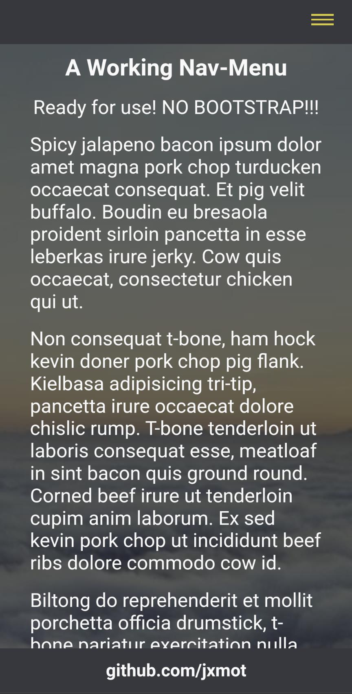
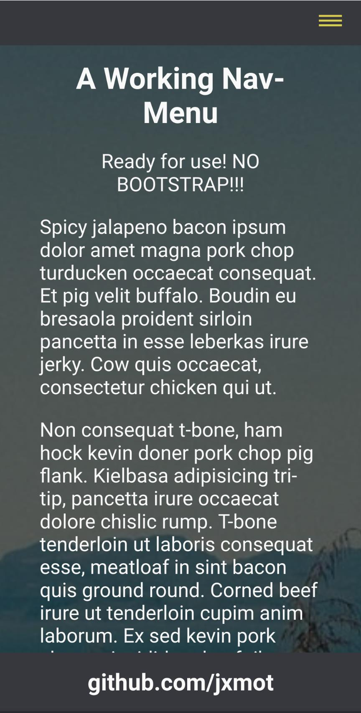
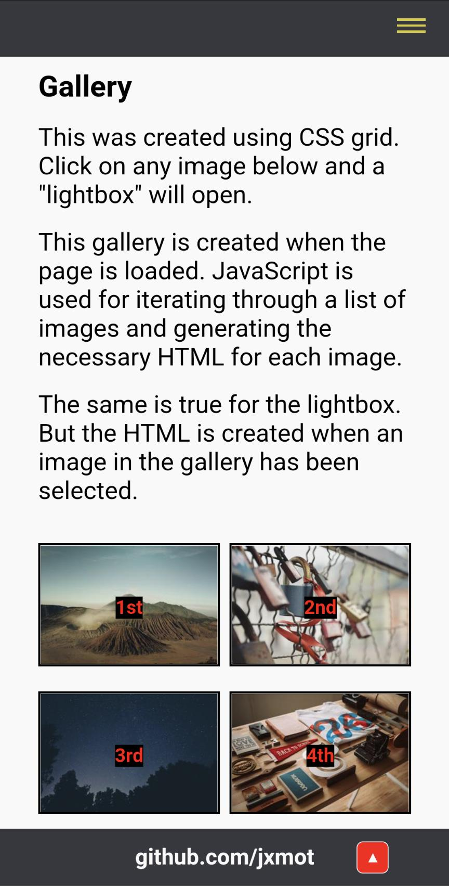
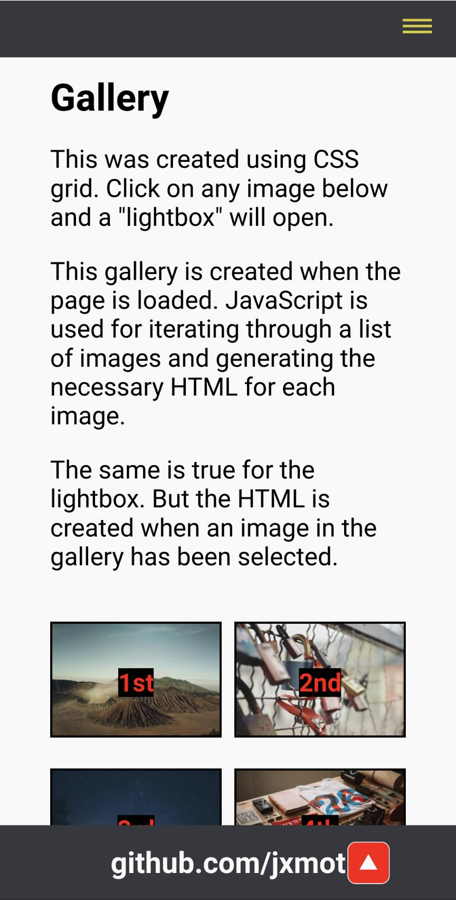

<h1 align="center">Website Template - NO BOOTSTRAP<h1>
<p align="center">Chapter 3<p>

# Desktop vs Mobile

This part is almost always a "gotcha" for me. One of the more frustrating tasks has been getting the whole "Desktop Vs Mobile" thing right. And my nemesis is *Firefox mobile*. The funny thing is I like the desktop version and use it for my everyday browsing. And I use Chrome desktop for development.

## Browsers Used for Testing

| **Browser** | Chrome  | Firefox |   Edge  |  Opera  | Safari  |
|:-----------:|:-------:|:-------:|:-------:|:-------:|:-------:|
| **Desktop** |    Y    |    Y    |    Y    |    Y    |    N    |
| **Mobile**  |    Y    |    Y    |    Y    |    Y    |    N    |

Desktop: Windows 10, 64bit, Pro, current version.
Mobile: Android 12, Pixel 5a

Sorry, I haven't been able to test with Safari or with the other browsers on Linux, or on Microsoft devices. If you (*the reader :smiley:*) are using any of those please take some screen shots and place them in an issue in this repository with information about the browser, device, and screen resolution. Thanks!

### Visible Differences

On desktop, with equally sized view areas there are no noticeable differences. However... on mobile (*wait for it*).... the browser that is "different" from the rest is... FIREFOX! My nemesis. LOL

<div align="center">
    <figure>
<!-- NOTE: When Github renders the images it will REMOVE the "margin", and ADD "max-width:100%" -->
        
        
        <br>
        <figcaption><strong>Chrome is on the left, Firefox on the right.</strong></figcaption>
    </figure>
</div>

<br>

<div align="center">
    <figure>
<!-- NOTE: When Github renders the images it will REMOVE the "margin", and ADD "max-width:100%" -->
        
        
        <br>
        <figcaption><strong>Chrome is on the left, Firefox on the right.</strong></figcaption>
    </figure>
</div>
<br>

I know the differences may seem subtle, or insignificant. But when you're trying to make both platforms look and *behave* identically those differences will drive you nuts. 

### `devdebug` Data Differences

**`window.`**

|   **Property**  | Chrome  | Firefox |   Edge  |  Opera  |
|:---------------:|:-------:|:-------:|:-------:|:-------:|
|  **innerWidth** |   376   |   378   |   376   |   376   |
| **innerHeight** |   684   |   688   |   636   |   636   |


**Element `#gototop-button.`**

|   **Property**   | Chrome  | Firefox |   Edge  |  Opera  |
|:----------------:|:-------:|:-------:|:-------:|:-------:|
|  **offsetWidth** |    27   |    **35**   |    27   |    27   |
| **offsetHeight** |    27   |    **35**   |    27   |    27   |


**`getComputedStyle(document.documentElement).fontSize`**

| **Font Size** | Chrome | Firefox | Edge | Opera |
|:-------------:|:------:|:-------:|:----:|:-----:|
|   **1 rem**   |  16px  | **20.8px**  | 16px | 16px  |


So, what does it all mean? Well... compared to the other browsers it appears that Firefox mobile has *scaled up* the font size. **Why?**

## Browser Detection

The browser detection code can be found in `assets/js/getbrowser.js`, and contains a function named `getBrowser()`. It is used for detecting *Firefox mobile*.

## On Page Load CSS Changes

An effort has been made to make the necessary "adjustments" to CSS when the Firefox mobile browser has been detected. 

### Body

The font size (`font-size`) is set to 95%. That's because in Firefox `1rem` is **20.8** pixels and not **16** as with every other browser.

See `nobs.js:adjustBody()`.

### Navigation

Additional space is required for the mobile navigation menu's closing "**X**". The `<div` that is using the `nav-header` class have `padding-top: 0.5em` added to its CSS.

See `nobs.js:adjustNav()`.

### Sections

Every `<section>` that uses the `section-body` class will have the right and left margins adjusted from `2rem` to `1rem`, and the `<ul>` within will have the left margin adjusted from `2rem` to `1.5rem`. 

See `nobs.js:adjustSection()`.

### To Top Button

This button was too large and in the wrong place when viewed in Firefox mobile. See [this](CH3.md#visible_differences), it's the second pair of images. The CSS adjustments made are - 

* `right: 5%` from 10%
* `width: 1.5em` from 2em
* `height: 1.5em` from 2em
* `font-size: 0.7em` from 1em

See `totop.js:adjustToTop()`.

### Lightbox

The "previous" and "next" buttons were too large and placed too high. Image caption text would collide with the buttons. Both buttons get the following adjustments:

* `margin-top: 6.5%` has been added
* `font-size: 1em` from 1.25em

See `nobs-lightbox.js:adjustLBox()`.

### The Result


### Adjustments Disclaimer

I've made the adjustments according to *what looks good to me*. You may disagree, so please feel free to make the changes that you feel are necessary.

## Bypass the Detection

It is possible to bypass the detection and display the page without any adjustments. The bypass can be enabled with a query:

```
http[s]://your-webserver/path/to/?byp
```

# Continue

To [chapter 4 - Deep Details](CH4.md)... (*get ready, it's a long chapter!*)
