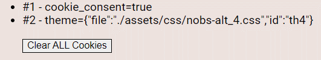

<h1 align="center">Website Template - NO BOOTSTRAP<h1>
<p align="center">Chapter 4<p>

# Modification Guidelines

## Where to Start?

A good question! I believe that the first step is to choose the piece(s) you want to modify or reuse. This chapter will mostly cover *reuse*.

## Modifying

Modifying what is here is up to you. Most everything is commented, or documented so that "stuff" is easy to find. 

*Software is like clay. It's malleable(usually) and if designed well then reshaping it is only dependent on one's imagination.*

## Reusing Features

This section is a guide to extracting and reusing some of the features found here in other projects. 

### Cookie Consent

This feature can be reused very easily. It consists of three parts:

* HTML - *details below*
* CSS - `cookies.css`
* JavaScript - `cookies.js`

This is the HTML for the Cookie Consent dialog:

```html
    <!-- Cookie Consent -->
    <div id="cookie_con" class="cookie-con">
        <div class="cookie-con-body">
            <div class="cookie-con-msg">
                <p id="cookie_con_text" class="cookie-con-text">
                    This page uses cookies. In fact, it uses 2 of them. The first one is for recording that you have 
                    consented, and the second one records your theme choice.
                </p>
            </div>
            <div class="cookie-con-accept">
                <button id="cc_accbutton" 
                class="cookie-con-button cookie-con-accbutton-bg">
                Accept
                </button>
            </div>
            <div class="cookie-con-decline">
                <button id="cc_decbutton" 
                class="cookie-con-button cookie-con-decbutton-bg">
                DECLINE
                </button>
            </div>
        </div>
    </div>
```

**Edit Before Using:**

* The consent dialog is positioned with `.cookie-con` (found in `cookies.css`). It's currently set at a fixed position  `3.1rem`*above* the bottom of the viewport to give room for the footer. Edit as necessary.
* Change the text between the `<p id="cookie_con_text" class="cookie-con-text"></p>` tags.
* Call `hasConsent()` as needed to manage the use of other cookies and/or features.

**Example of Cookie Use:**

The visibility of the consent dialog and responses to the "Accept" or "DECLINE" buttons are managed in `cookies.js`. 

Using the "theme" selection as an example, here is how you might check the consent cookie and load theme cookie when the page is ready:

**Pseudo-Code:**
```pseudocode
When the page is ready:
  If hasConsent() is present and it returns true then
    Read the theme cookie
    If the theme cookie is present then
      Parse the cookie data
      Apply the CSS file that it specifies
      Select the radio button that it specifies
    End If
  End If
  
  Wait for a theme selection 
    Load the selected theme
    If hasConsent() is present and it returns true then
      Save the theme cookie
    End If
End
```

```javascript
$().ready(() => {
    // if cookie functionality is loaded then check the consent...
    if((typeof hasConsent === 'function') && (hasConsent() === true)) {
        // was the theme set on the last visit?
        // if it was then change the theme.
        var thm = getCookie('theme');
        if(thm !== '') {
            t = JSON.parse(thm);
            loadCSS(t.file);
            // set the radio button
            $('.themesw').prop('checked', false);
            $('#'+t.id).prop('checked', true);
        }
    }

    // handle theme selections...
    $('.themesw').click(function(event) {
        loadCSS(event.target.value);
        // if cookie functionality is loaded then check the consent...
        if((typeof hasConsent === 'function') && (hasConsent() === true)) {
            // when the theme is changed remember it in cookie.
            makeCookie('theme', {file: event.target.value, id: event.target.id});
        }
    });
});
```

When one of the theme selection radio buttons is selected the `$('.themesw').click(function(event) {})` handler will load the CSS theme file and then save a cookie. The cooking will contain a JSON string - 

```json
{
  "file":"./assets/css/nobs-alt_3.css",
  "id":"th3"
}
```
#### Cookies and Devdebug

Under `#devdebug` is a section that displays the current cookies. It will show you if any cookies exist, and if they do it will display the cookie's contents and a button for *deleting all cookies*.

<div align="center">
    <figure>
        
        <br>
        <figcaption><strong>First page load, no cookies have been saved.</strong></figcaption>
    </figure>
</div>
<br>

<div align="center">
    <figure>
        
        <br>
        <figcaption><strong>The cookie consent has been accepted and a theme was saved.</strong></figcaption>
    </figure>
</div>
<br>

The text will update if the "Clear All Cookies" button is clicked. After a short delay the page will reload and position contents at the top of the page.

### To Top Button

This feature can be reused very easily. It consists of three parts:

* HTML - *details below*
* CSS - `nobs-totop.css`
* JavaScript - `totop.js`

The HTML portion (a `<button>`) is located in the `<footer>`:

```html
    <!-- Page Footer -->
    <footer id="page_footer" class="footer">
        <h3 class="footer-text"><a href="https://github.com/jxmot" target=_blank>github.com/jxmot</a></h3>
        <!-- kept in the footer & keep it anchored with CSS -->
        <button id="gototop_button" class="gototop" onclick="jumpToTop()" title="Go to top of page">
            <span id="gototop_span" class="gototop-span">&#9650;</span>
        </button>
    </footer>
```

**NOTE:** For reuse, copy the `nobs-totop.css` to `toptop.css` and edit the colors to *not* use CSS variables. Unless you're reusing the theme CSS files. 

If you're going to reuse it without a footer you will need to wrap the `<button>` in a `<div>` and use the following 
CSS - 

```css
.totop-div {
  bottom: 0;
  position: fixed;
  width: 100vw;
  height: 3rem;
}
```

```html
<div class="totop-div">
  <button id="gototop_button" class="gototop" onclick="jumpToTop()" title="Go to top of page">
    <span id="gototop_span" class="gototop-span">&#9650;</span>
  </button>
</div>
```

**Edit Before Using:**

The "To Top" CSS file has been named with `nobs_` because it references colors in the palette and theme CSS files. You could rename it to `totop.css` and change the colors from CSS variables to actual values.

**Usage Example:**

```javascript
// top of page anchor
const pagetop = '#main';
// this will contain the height of .nav-header 
var hdrheight = -1;
// this function uses hdrheight to calculate 
// where to jump. it allows for the height of 
// the nav bar.
function nobs_scrollTo(href) {
    var goTo = '';
    // let's close the nav menu...
    $('#nav-togg')[0].checked = false;
    // has the header height been obtained yet?
    if(hdrheight !== -1) {
        if(href.charAt(0) === '#') {
            goTo = href;
        } else {
            let tmp = href.split("#");
            goTo = '#'+tmp[1];
        }
        $('html').stop(true).animate({
            scrollTop: ($(goTo).position().top - hdrheight)
        },450); // NOTE: Any value greater than ~450 will cause 
                // the scroll to miss its target. Why?
    } else consolelog('nobs_scrollTo() - bad hdrheight');
};

// When the user clicks on the button, scroll to the top of the document
function jumpToTop() {
    nobs_scrollTo(`${pagetop}`);
};
```

```javascript
$().ready(() => {
    // this is the best place to get the height of the 
    // <header> that contains the nav menu.
    hdrheight = $('.nav-header').height();
    // Set the bottom padding for ${pagetop}, all of the pages'
    // content goes inside. The <header> and <footer> must 
    // stay contain all of ${pagetop}
    $(`${pagetop}`).css('padding-bottom', ($('#page_footer').height() + ($('#page_footer').height() * 0.15)) + 'px');
});
```

### Browser Detection

Browser detection consists of the following:

* HTML - **none**
* CSS - **none**
* JavaScript - `getbrowser.js`

**Edit Before Using:**

#### Acting on Detection Results

There are a number of "adjustment" functions that are called when an undesirable browser is detected:

* `nobs.js:adjustBody()` - Currently not used, otherwise it would adjust the font size.
* `nobs.js:adjustSection()` - Adjust `<section>` margins.
* `nobs.js:adjustNav()` - Follow this function call with `hdrheight = $('.nav-header').height();`. Adds some padding to the top.
* `nobs.js:adjustFooter()` - Adjust `<footer>` font size and height.
* `totop.js:adjustToTop()` - 
* `nobs-lightbox.js:adjustLBox()` - 
* `cookies.js:adjustCookies()` - 

The "adjustment" functions are detailed below.

**`nobs.js:`**
```javascript
// let's see which browser is being used (getBrowser() 
// is found in getbrowser.js)
const browserinfo = getBrowser();
// FireFox mobile is an oddball. It does not render 
// pages the same as Chrome mobile. When #devdebug is 
// enabled the differences can be seen in the data.
const badbrowser = (browserMasks[FIREFOX][BMASK] | browserMasks[GECKO][BMASK] | browserMasks[MOBILE][BMASK]);

$().ready(() => {
    // this is the best place to get the height of the 
    // <header> that contains the nav menu.
    hdrheight = $('.nav-header').height();
    // Set the bottom padding for ${pagetop}, all of the pages'
    // content goes inside. The <header> and <footer> must 
    // stay contain all of ${pagetop}
    $(`${pagetop}`).css('padding-bottom', ($('#page_footer').height() + ($('#page_footer').height() * 0.15)) + 'px');

    // if we're being viewed in a "bad" browser 
    // then make the necessary adjustments
    if(badbrowser === browserinfo.mask) {
        // <body> adjustments 
//        adjustBody();
        // <section> adjustments
        adjustSection();
        // <nav> adjustments 
        adjustNav();
        hdrheight = $('.nav-header').height();
        // to-top button
        adjustToTop();
        // <footer> adjustments
        adjustFooter();
        // lightbox adjustments
        adjustLBox();
        // don't adjust the cookie consent unless 
        // it is present
        if(typeof adjustCookies === 'function') {
            adjustCookies();
        }
    }
});
```

The current "adjustment" functions are - 

**`nobs.js`:**
```javascript
function adjustBody() {
    $('body').css('font-size','95%');
};

function adjustSection() {
    $('.section-body').css('margin-left','1rem');
    $('.section-body').css('margin-right','1rem');

    $('.section-body ul').css('margin-left','1.5rem');
};

function adjustNav() {
    // pushes the navbar down so that the 
    // "X" is fully visible.
    $('.nav-header').css('padding-top','0.5em');
};

function adjustFooter() {
    // footer text <h3> size adjust
    $('.footer-text').css('font-size', '1em');
    // footer height 
    $('.footer').css('height','2em');
};
```

**`totop.js`:**
```javascript
// called as needed after the page has loaded, this will 
// adjust the size of the to-top button. (Firefox SUCKS!)
function adjustToTop() {
    // the values of these adjustments are dependant 
    // on the values in .gototop(totop.css)
    document.getElementById('gototop_button').style.right  = '5%';
    document.getElementById('gototop_button').style.width  = '1.5em';
    document.getElementById('gototop_button').style.height = '1.5em';
    document.getElementById('gototop_span').style.fontSize = '0.7em';
};
```

**`nobs-lightbox.js`:**
```javascript
// fine tune the lightbox when necessary
function adjustLBox() {
    $('.lb-prev').css('margin-top', '6.5%');
    $('.lb-next').css('margin-top', '6.5%');

    $('.lb-prev').css('font-size', '1em');
    $('.lb-next').css('font-size', '1em');
};
```

**`cookies.js`:**
```javascript
function adjustCookies() {
    $('.cookie-con').css('margin-left','0.5rem');
    $('.cookie-con').css('margin-right','0.5rem');
    $('.cookie-con-button').css('font-size','0.75rem');
};
```

## Adding Features

# The End!

Or... back to the [beginning](README.md)...