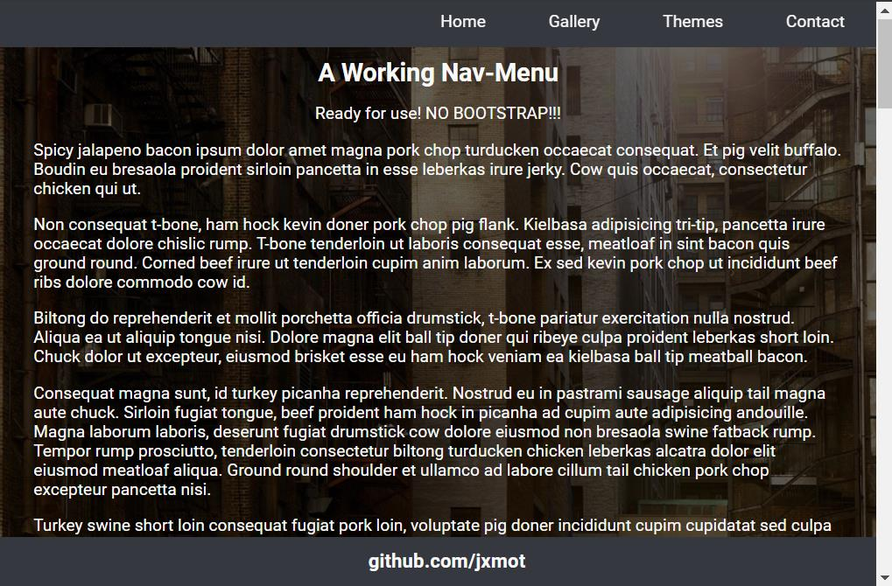

<h1 align="center">Website Template - NO BOOTSTRAP<h1>
<p align="center">Chapter 1<p>

# Overview

This repository contains a website *template*. It is intended as a starting point for the primary page of a website. In reality it's more like a *framework*, all of the working pieces are already there.

# Purpose

The intent is to make it easier and quicker to create a website *without using Boostrap*.  

I wanted a *basic*, *simple* and *working* website template. It had to have a navigation bar and be *responsive*... it seems that everyone has a different definition of what *resposive* actually means. 

After some (*ok, more than just "some"*) frustration getting Bootstrap to cooperate on a number of issues:

* Not all browsers(or platforms!) produce the same results
* Bootstrap CSS is an excellent CSS framework, but too complicated and too much overhead for basic needs
* I'm tired of it lol
* By comparison, Bootstrap requires more HTML than without it to achieve the same results

## The Result

After some research, experimentation, and playing around I put together what you see in this repository. Before I even started I had some expectations to fill:

* Must be responsive
* Must work, the navigation menu must operate and select targets
* Must work with or without the "logo" component of the navigation bar
* Must be usable as a *basic* starting point for other web page projects

It was also quite frustrating just *finding* **working** examples of a non-Bootstrap "responsive" page with a navigation menu. Too often I'd find something that(*pick one or more of the following...*):

* Did not work at all
* Was not truly "responsive"
* The "code" was poorly written and/or disorganized
* The author didn't test their work

So, here's what I've got now... (*although it's more like a framework*)

# High Level Details

This repository contains a *single page* site. It has a simple layout that is responsive and if necessary it can dynamically adjust its CSS depending on the browser and device used.

<div align="center">
    <figure>
        
        <br>
        <figcaption><strong>Desktop Screenshot</strong></figcaption>
    </figure>
</div>

## Technologies Used

Well, there is the *obvious* stuff like HTML, CSS, Javascript & JQuery. Beyond that in CSS I'm using *grid* to align elements on the page. At first it was slightly confusing especially coming from a Bootstrap mindset.

And I'm using those 4 technologies to do things like:

* Manipulate and create DOM objects
* Detect browser and device type
* Dynamically load CSS or JavaScript
* And more!

The "lorem ipsum" content was obtained at - <https://baconipsum.com/>

### Toolbox

* [Notepad++](<https://www.google.com/url?sa=t&rct=j&q=&esrc=s&source=web&cd=&cad=rja&uact=8&ved=2ahUKEwjwu_WZof32AhXQHDQIHa2ZDV0QFnoECAoQAQ&url=https%3A%2F%2Fnotepad-plus-plus.org%2F&usg=AOvVaw0iXSCYMB4lh5GlGEAEs2Jd>) - This will always be my favorite editor.
* [Markdown Edit](<https://mike-ward.net/markdownedit/>) and on [github](<https://github.com/mike-ward/Markdown-Edit>) - It is a bit old, and hasn't been updated in a while but it works very well for me. YMMV.
* [Bitvise](<https://www.bitvise.com/>) - A very good, and free SSH client with SFTP.
* [Winmerge](<https://winmerge.org/>) - My favorite diff/merger tool.
* [AstroGrep](<http://astrogrep.sourceforge.net/>) - For windows, grep in a GUI.
* [Gitkraken](<https://www.gitkraken.com/>) - My favorite Git repository manager.
* Chrome Developer Tools
* [Autoprefixer](<https://github.com/postcss/autoprefixer>) and on [npmjs](<https://www.npmjs.com/package/autoprefixer>) - The CSS files in this repository have been process with Autoprefixer, it will add or remove browser prefixes.
* [CSS Grid Layout Generator](<https://angrytools.com/css-grid/>) - Easy to use, I looked at a few grid generators and this one has the cleanest UI.

If you would like to use the Autoprefixer I have it ready for installation. Go to my [Autoprefixer README](utils/autoprefixer/README.md) for more information.

## File Organization

### Folder Hierarchy

```
/ ──public_html
    └───assets
        ├───css
        ├───jq
        └───js
```
* `public_html` - `index.html` and favicon image files
* `public_html/assets/css` - all CSS files
* `public_html/assets/jq` - contains `jquery-3.6.0.min.js`
* `public_html/assets/js` - all JavaScript files

### Naming Conventions

Files have been named so that *common & non-site specific* files are easily located. The *site specific* files are also easy to identify:

* Files names that begin with **`nobs_`** are specific to this *project* and contain *references* to other *project specific* source file elements within it.
* Files without **`nobs_`** are generic and can be easily used with other projects. Some minor editing may be required.

Functions and globally used variables are also named so that their *purpose* and containing *file* can be determined easily. 

# Continue

To [chapter 2 - Features](CH2.md)...

---

