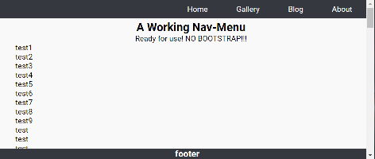
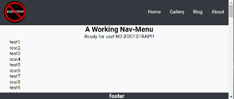
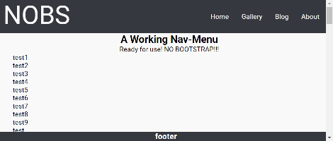
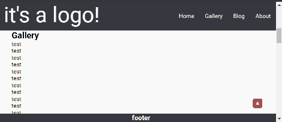
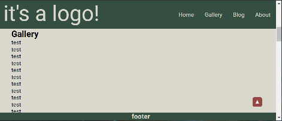

**IMPORTANT: This document is in "DRAFT", and needs to be updated. Most of the content is correct, but recent changes need to be incorporated.**

**NOTE: The demonstration link below will point to a *current* version of this repository. It is used for testing changes so occasionally it may not work.**

# Website Template - NO BOOTSTRAP

I wanted a *basic*, *simple* and *working* website template. It had to have a navigation bar and be *responsive*... it seems that everyone has a different definition of what *resposive* actually means. 

After some (*ok, more than just "some"*) frustration getting Bootstrap to cooperate on a number of issues:

* Not all browsers(or platforms!) produce the same results
* Bootstrap CSS is an excellent CSS framework, but too complicated and too much overhead for basic needs
* I'm tired of it lol

## The Result

After some research, experimentation, and playing around I put together what you see in this repository. Before I even started I had some expectations to fill:

* Must be responsive
* Must work, the navigation menu must operate and select targets
* Must work with or without the "logo" component of the navigation bar
* Must be usable as a *basic* starting point for other projects

It was also quite frustrating just *finding* **working** examples of a non-Bootstrap "responsive" page with a navigation menu. Too often I'd find something that(*pick one or more of the following...*):

* Did not work at all
* Was not truly "responsive"
* The "code" was poorly written and/or disorganized
* The author didn't test their work

So, here's what I've got now...

## Details

There are several *essential* files:

* `index.html`
* `reseter.css` - resets the browsers' CSS and creates a consistent result across multiple browsers and platforms, this was obtained from [github.com/resetercss/reseter.css](<https://github.com/resetercss/reseter.css>)
* `nobs.css` - overall page styling
* `nobs.js` - all of the menu handling, initiating logo or no-logo, and page scrolling
* `logo.js` - for managing the visibility of the "logo" component of the navigation bar

Managing the colors (or "theme") is done with:

* `nobs-palettes.css` - CSS variables containing a number of colors, and some grouped together as *palettes*
* `nobs-default.css` - a "default" color scheme

These are for the "Gallery":

* `nobs-gallery.css` - 

These are for the "Contact" form:

* `nobs-contact.css` - 
* `nobs-contact.js` - 

These manage the "to top" button:

* `totop.css` - button appearance, size, and location
* `totop.js` - button management, scrolling is accomplished in `nobs.js:scrollTo()`

The rest are related to favicon images.

The only external resource used is jQuery.

Here is a *live* demonstration: [Website Template - No Bootstrap](<https://webexperiment.info/portfolio/wtnobs/>)

### Navigation

The HTML portion of the navigation is somewhat *unique* when compared to others I've seen. Most were using a `<input type="button">`, but what you will find here uses `checkbox` instead of a `button` type.

```
    <!-- Navigation Bar -->
    <header id="nav-header" class="nav-header">
        <!-- Hamburger Icon -->
        <input id="nav-togg" type="checkbox"/>
        <label id="nav-close" class="nav-icon" for="nav-togg">
            <span class="nav-icon-line"></span>
        </label>
        <!-- Menu -->
        <nav id="nav-menu" class="nav">
            <ul class="menu">
                <li><a id="home" class="navitem" href="#main">Home</a></li>
                <li><a id="nav1" class="navitem" href="#navtarg1">Gallery</a></li>
                <li><a id="nav2" class="navitem" href="#navtarg2">Blog</a> </li>
                <li><a id="nav3" class="navitem" href="#navtarg3">About</a></li>
            </ul>
        </nav>
    </header>
```

The file `nobs.js` contains all of the code that handles the navigation menu. This includes scrolling correctly and not missing the menu item targets.

Here is the menu item handler:

```
    /*
        wait for a click from any menu item... 
    */
    $('.navitem').click(function(event) {
        consolelog('navitem target: ' + event.target.id);
        consolelog('navitem href: ' + event.target.href);

        // Prevent the default action from occuring.
        event.preventDefault();

        // let's close the nav menu...
        $('#nav-togg')[0].checked = false;

        // scroll to the target ID, and place it just 
        // below nav bar (when inactive).
        scrollTo(event.target.href);
    });
```

Here is the `scrollTo()` function:

```
// this function uses hdrheight to calculate 
// where to jump. it allows for the height of 
// the nav bar.
function scrollTo(href) {
    var goTo = '';
    // has the header height been obtained yet?
    if(hdrheight !== -1) {
        if(href.charAt(0) === '#') {
            goTo = href;
        } else {
            let tmp = href.split("#");
            goTo = '#'+tmp[1];
        }
        $('html').stop(true).animate({
            scrollTop: ($(goTo).position().top - hdrheight)
        },450); // NOTE: Any value greater than ~450 will cause 
                // the scroll to miss its target. Why?
    } else consolelog('scrollTo() - bad hdrheight');
};
```

The value `hdrheight` is calculated after the page is loaded:

```
// this will contain the height of #nav-header 
var hdrheight = -1;

$().ready(() => {
    // this is the best place to get the height of the 
    // <header> that contains the nav menu.
    var hdrheight = $('#nav-header').height();
              .
              .
              .
});
```

### Responsiveness

Only one type of media break is used: `@media (min-width: 768px)`. 

### Extras

**Scrolling:**

Typically scrolling a page to a `#` target is good enough. However, with the navigation bar the targets end up *behind* it. Since the menu selections are handled in `nobs.js` adjusting the scroll is easy:

First the height of the navigation bar is needed (*when it's inactive*) -

```
var hdrheight = $('#nav-header').height();
```

Basically it will scroll to a position that is *above* the target by a distance equal to the height of the navigation bar plus 15% of its original size.

**Footer:** Personally, I like a footer that sticks to the bottom of the *window*... not at the bottom the page. But that can be problematic. Especially if the content extends below the footer. It won't be seen.

But that is taken care of here. A simple calculation and then changing the `padding-bottom` style of the main content tag:

```
$('#main').css('padding-bottom', ($('#page-footer').height() + ($('#page-footer').height() * 0.15)) + 'px');
```

Here's the associated HTML:

```
<main id="main" class="main-content">
  <!-- page content goes here -->
</main>

<footer id="page-footer" class="footer">
    <h3 class="footer-text">footer</h3>
</footer>
```

Here's the calculation:

```
($('#page-footer').height() + ($('#page-footer').height() * 0.15)) + 'px'
``` 

It takes the height of the `<footer>` and adds a little, the value is in **px** (pixels). Then that value is placed in the 'padding-bottom' attribute of `<main id="main" class="main-content">`.

**Closing the Menu:**

As mentioned above in the [Navigation](#navigation) section this menu uses a *checkbox* instead of a button. So to close the menu *programmatically* just clear it:

```
// let's close the nav menu...
$('#nav-togg')[0].checked = false;
```

**Hamburger:**

I didn't actually "add" the hamburger. But the way it works is *unique* and worth mentioning. It **does not** use:

* Fontawesome
* Special characters
* Magic (*maybe it does?*)

It's all done with CSS and I'm in the process of figuring out exactly how it works. I'll update here once that's done.

**"To Top" Button:**

A "to top" button has been added to the template. It is contained in `totop.css` and `totop.js`. The `<footer>` has also been modified to contain the button:

```
<footer id="page-footer" class="footer">
    <h3 class="footer-text">footer</h3>
    <!-- kept in the footer to keep it anchored -->
    <button id="gototop-button" class="gototop" onclick="jumpToTop()" title="Go to top of page">&#9650;</button>
</footer>
```

Unique to this "to top" button is that you can set the amount of travel that the document has to move before the button is made visible.

In **`totop.js`**:

```
// a percentage of document size, if scrolled past this
// point the "to top" button will be displayed.
const scroll_travel = 0.05;
```

Here is the function used for determining if the button should be shown:

```
// returns true if the "to top" button should be made visible
function showToTop() {
    // the point where the the button appears is based on the 
    // percentage of the height of the document and NOT the window.
    if(Math.round(($(document).height() * scroll_travel)) < document.documentElement.scrollTop) return true;
    else return false;
}
```

Each time the document is scrolled the `showToTop()` is called:

```
// call our function when the window contents are scrolled
window.onscroll = function() {onWindowScroll()};

function onWindowScroll() {
    if(showToTop()) {
        document.getElementById("gototop-button").style.display = "block";
    } else {
        document.getElementById("gototop-button").style.display = "none";
    }
}
```

**Logo or NO Logo?:**

It's possible to view the page with or without the logo in the navigation bar. There are 2 types to pick from, `'icon'` or `'text'`.

Turning on the logo(icon or text) is done with a *query*. For example:

* `http://server/path/to/index.html` - no logo will be seen, the navigation bar is shorter and the padding is reduced around the menu items.
* `http://server/path/to/index.html`**`?logo=icon`** - this will enable the *icon* on the left side of the navigation bar.
* `http://server/path/to/index.html`**`?logo=text`** - this will enable the *text* on the left side of the navigation bar. In addition it is possible to alter the text:
  *  `http://server/path/to/index.html?logo=text`**`&text=some%20text`** - *uri encoding is required*

When the "logo" is enabled the link it contains will also have the query string attached. Then it will work as expected and when it is clicked you will go to `index.html` using your original query.

Here are examples of each:

**No Logo:**

<p align="center">
  
</p>

**Icon Logo:**

<p align="center">
  
</p>

**Text Logo:**

<p align="center">
  
</p>

**Color Themes:**

I change all of the color related CSS to use *variables*. Then it was easy to put together some *themes* with different colors. 

The CSS files are:

* `nobs_palettes.css` - palettes arranged as groups of CSS color variable.
* `nobs-default.css` - the default theme
  * `nobs-alt_1.css`, `nobs-alt_2.css`, `nobs-alt_3.css`, `nobs-alt_4.css` - alternate themes
* `nobs-totop.css` - "to top" uses colors kept in `nobs_palettes.css`

In `index.html` changing the coloring is done by commenting/uncommenting the desired CSS theme file:

```
<!-- color palettes -->
<link rel="stylesheet" href="./assets/css/nobs-palettes.css">
<!-- "themes", choose & edit as needed -->
<link rel="stylesheet" href="./assets/css/nobs-default.css">
<!-- <link rel="stylesheet" href="./assets/css/nobs-alt_1.css"> -->
<!-- <link rel="stylesheet" href="./assets/css/nobs-alt_2.css"> -->
<!-- <link rel="stylesheet" href="./assets/css/nobs-alt_3.css"> -->
<!-- <link rel="stylesheet" href="./assets/css/nobs-alt_4.css"> -->
<!-- the rest of it... -->
<link rel="stylesheet" href="./assets/css/nobs.css">
<link rel="stylesheet" href="./assets/css/nobs-totop.css"/>
```

Here is the "default" (`nobs-default.css`) theme - 

<p align="center">
  
</p>

And this is one of the "alternate" (`nobs-alt_1.css`) themes - 

<p align="center">
  
</p>

